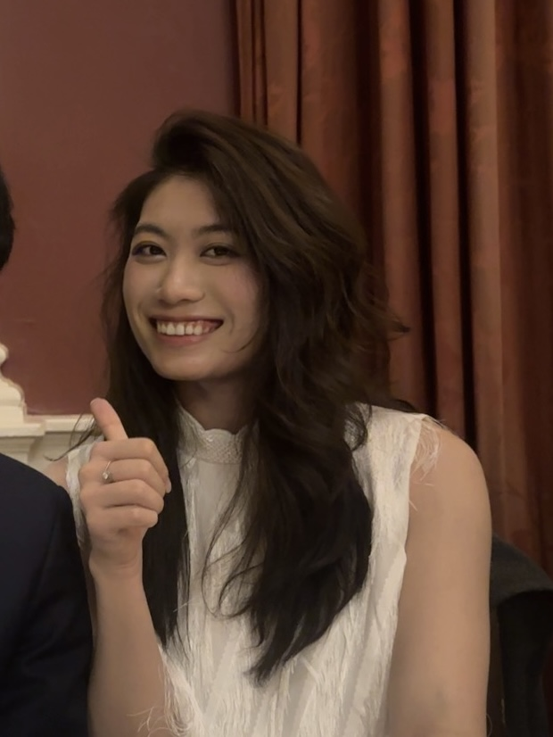

```{=html}
<section class="home-hero" aria-labelledby="home-name">
<div class="hero-copy"><p class="eyebrow">History · Anthropology · Science & technology</p><h1 id="home-name">Qing Han<span lang="zh" class="name-cn">韩晴</span></h1><p class="hero-statement">Knowledge, technology,<br>and <em>social life.</em></p><p class="hero-description">I am a researcher trained in social anthropology at the University of Oxford. Through historical inquiry and ethnographic research, I study how people establish what counts as knowledge, care, and value. My work follows these questions through cultural heritage translation, digital intimacy, and the institutions developing and evaluating new technologies.</p><a class="text-link" href="research.html">Explore my research <span aria-hidden="true">↗</span></a></div>
<figure class="hero-portrait"><figcaption><span>Qing Han</span><span>Research & practice</span></figcaption></figure>
</section>
<div class="theme-strip"><span>Histories of knowledge</span><span>Ethnographies of technology</span><span>Valuation & social life</span></div>
<section class="home-research" aria-labelledby="research-heading"><div class="section-heading"><div><p class="eyebrow">01 / Inquiry</p><h2 id="research-heading">Selected research</h2></div><a class="text-link" href="research.html">All research <span aria-hidden="true">↗</span></a></div><a class="work-row" href="research/aging-futures.html"><span class="work-number">01</span><div><p class="eyebrow">Aging · Markets · Care</p><h3>Governing Aging Futures</h3><p>How does population aging become a future that can be forecast, invested in, and addressed through technology?</p></div><span class="row-arrow" aria-hidden="true">↗</span></a><a class="work-row" href="research/shared-husbands.html"><span class="work-number">02</span><div><p class="eyebrow">Intimacy · Digital ethnography</p><h3>Fantamacy: Fantasy Intimacy</h3><p>Mengnü culture, fantasy intimacy, and the social and technical making of relationships.</p></div><span class="row-arrow" aria-hidden="true">↗</span></a><a class="work-row" href="research/hongshan.html"><span class="work-number">03</span><div><p class="eyebrow">Language · Cultural heritage</p><h3>Translation as Governance</h3><p>Hongshan heritage, the histories of archaeological categories, and the institutional work of translation.</p></div><span class="row-arrow" aria-hidden="true">↗</span></a><a class="work-row" href="research/ai-talent.html"><span class="work-number">04</span><div><p class="eyebrow">AI · Evaluation · Work</p><h3>Who Counts as Good Talent?</h3><p>ByteDance, changing ideals of talent, and the politics of AI recruitment.</p></div><span class="row-arrow" aria-hidden="true">↗</span></a></section>
<section class="practice-section" aria-labelledby="practice-heading"><div class="section-heading"><div><p class="eyebrow">02 / Practice</p><h2 id="practice-heading">Selected practice</h2></div><a class="text-link" href="projects.html">View projects <span aria-hidden="true">↗</span></a></div><div class="project-grid">
<a class="project-card" href="projects/turingpal.html"><p class="eyebrow">AI companionship</p><h3>TuringPal <span aria-hidden="true">↗</span></h3><p>Designing for companionship, continuity, and family life.</p></a>
<a class="project-card" href="projects/digital-heritage.html"><p class="eyebrow">Cultural heritage</p><h3>Digital Heritage <span aria-hidden="true">↗</span></h3><p>Making evidence and interpretation visible through interaction.</p></a>
<a class="project-card" href="projects/restaurant-membership.html"><p class="eyebrow">Product & service design</p><h3>Everyday Systems <span aria-hidden="true">↗</span></h3><p>Translating restaurant membership practices into tools for real operations.</p></a>
</div></section><section class="closing-note"><p class="eyebrow">A common thread</p><p>My research connects the history of categories to their use in everyday decisions. Translation, care technologies, and recruitment offer different settings in which to ask how descriptions of people and the past become standards for action.</p><a class="text-link" href="about.html">More about me <span aria-hidden="true">↗</span></a><a class="text-link contact-link" href="mailto:qinghan.research@gmail.com">qinghan.research@gmail.com</a></section>
```
