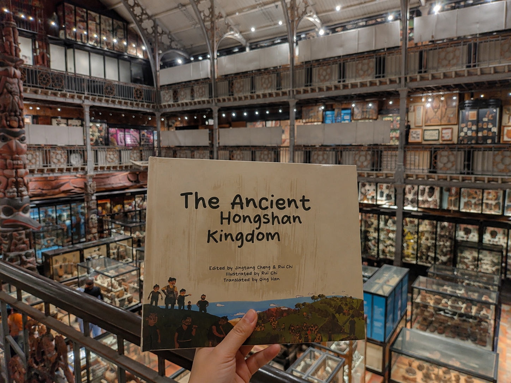

```{=html}
<header class="page-intro"><p class="eyebrow">Writing & translation</p><h1>Thinking, in words.</h1><p class="page-deck">Published translation, dissertation work, and developing essays across academic and public contexts.</p></header>
```

```{=html}
<section class="published-book" aria-labelledby="book-heading"><a class="book-feature-photo" href="writing/ancient-hongshan-kingdom.html"></a><div class="book-feature-copy"><p class="eyebrow">Published translation · Picture book</p><h2 id="book-heading">The Ancient<br>Hongshan Kingdom</h2><p class="book-chinese" lang="zh">红山古国</p><p>A children’s picture book introducing Hongshan cultural heritage across languages. English translation by Qing Han.</p><a class="text-link" href="writing/ancient-hongshan-kingdom.html">Explore the book <span aria-hidden="true">↗</span></a></div></section><section class="writing-group"><h2>Academic writing</h2><a class="work-row" href="research/shared-husbands.html"><span class="work-number">01</span><div><p class="eyebrow">MSc dissertation · 2025</p><h3>Fantamacy: Fantasy Intimacy</h3><p>Mengnü culture and fantasy intimacy: an ethnographic approach to technologically mediated relationships.</p></div><span class="row-arrow" aria-hidden="true">↗</span></a><a class="work-row" href="writing/silver-economy.html"><span class="work-number">02</span><div><p class="eyebrow">Working study</p><h3>The Silver Economy</h3><p>A conceptual history of changing policy language around aging and care.</p></div><span class="row-arrow" aria-hidden="true">↗</span></a><a class="work-row" href="writing/talent.html"><span class="work-number">03</span><div><p class="eyebrow">Working study</p><h3>Talent, Defined</h3><p>ByteDance and the changing definition of good talent in the AI era.</p></div><span class="row-arrow" aria-hidden="true">↗</span></a><a class="work-row" href="writing/ai-recruitment.html"><span class="work-number">04</span><div><p class="eyebrow">Working study</p><h3>AI Recruitment & Evaluation</h3><p>Measurement, validity, bias, and the authority of automated hiring judgments.</p></div><span class="row-arrow" aria-hidden="true">↗</span></a><a class="work-row" href="writing/absent-other.html"><span class="work-number">05</span><div><p class="eyebrow">Exploratory essay</p><h3>Love and the Absent Other</h3><p>Questions about the recognition of intimacy across historical and cultural settings.</p></div><span class="row-arrow" aria-hidden="true">↗</span></a></section><section class="writing-group"><h2>Translation & editorial work</h2><div class="translation-panel"><p class="eyebrow">Chinese ↔ English / Hongshan cultural heritage</p><h3>Making knowledge travel.</h3><p>Alongside my published translation of <em>The Ancient Hongshan Kingdom</em>, my work includes scholarly translation and a developing terminology reference that records sources, alternative renderings, and editorial decisions.</p><a class="text-link" href="research/hongshan.html">Read about the translation work <span aria-hidden="true">↗</span></a></div></section>
```
